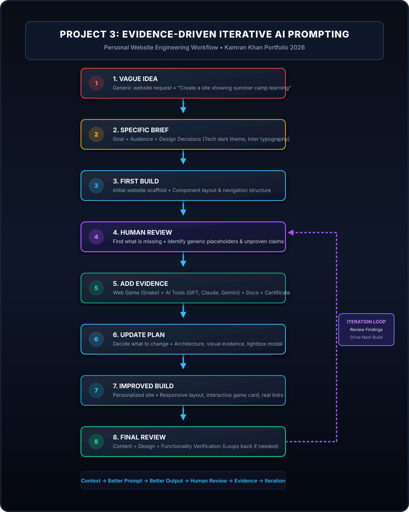

# Project 3 — Personal Website: Evidence-Driven Iterative AI Prompting

[](https://www.python.org/)
[](https://fastapi.tiangolo.com)
[](https://react.dev)
[](https://vitejs.dev)
[](https://www.governorsindh.com)

A complete, production-grade personal portfolio website engineered for **Kamran Khan** as part of **Project 3 of AI Prompting in 2026**.

The core objective of this project is to demonstrate how **better prompting, personal context, real evidence, human review, and iterative refinement** produce an authentic, verifiable product that far outperforms a generic first attempt.

---

## 1. Project Overview

Modern Generative AI models default to generic templates when prompts lack concrete context. When asked to "create a personal website for a summer camp student", an LLM hallucinates cliché phrases (*"I am deeply passionate about technology"*), fictitious projects, and unproven skills.

This project implements an **evidence-driven iterative engineering pipeline**. By supplying grounded personal data, real web game references, practical AI assistant workflows, and a verified examination certificate, the portfolio transitions from a vague concept to an authentic professional showcase.

---

## 2. Project Goal

To present Kamran Khan professionally to the world, answering:
* **Who is Kamran Khan?** An active GIAIC student, Agentic AI & Python developer, digital marketer, and cloud learner.
* **What has he learned?** Applied Generative AI, context engineering, API development, canvas web game mechanics, and SEO.
* **What can he build?** Lightweight backend APIs, responsive web interfaces, interactive game loops, and agentic workflows.
* **What AI tools does he work with?** ChatGPT (OpenAI), Claude (Anthropic), and Gemini (Google).
* **What did he learn from AI Prompting 2026?** Context engineering, instruction hierarchy, and evidence anchoring.
* **What projects demonstrate his skills?** Web game development showcase and Python orchestrator architectures.
* **What certification did he receive?** Official GIAIC Summer Camp completion certificate earned via formal examination.
* **How can someone contact him?** Via direct contact channels and guidance inquiries.

---

## 3. Target Audience

The website is architected to address:
1. **Friends & Relatives:** Clear explanation of Kamran's learning path and achievements.
2. **Local Businesses:** Practical guidance on adopting ChatGPT, Claude, and Gemini for workflows.
3. **Potential Clients:** Verifiable technical competence in Python, web development, and digital marketing.
4. **Professional Connections:** Clean architecture, open codebases, and authentic student status.
5. **Tech Peers & AI Learners:** Concrete demonstrations of iterative prompt engineering.

---

## 4. Problem with the Novice Prompt

The original novice prompt that started this journey was:
> *"I was in Summer Camp learning AI this June. Now I am thinking to create a personal website that shows everything about me and what I have learned in this Summer Camp. Share what goes into the personal website."*

### Why this prompt fails:
* **Zero Persona Grounding:** No student name, educational background, or geographical context.
* **Cliché Placeholders:** Generates cookie-cutter filler text without substance.
* **Unverifiable Claims:** Lists random technologies without proof of implementation.
* **Missing Artifacts:** No link to syllabus, playable games, or certificates.
* **No Design Strategy:** Ignores visual hierarchy, audience tailoring, and brand personality.

---

## 5. Improved Prompting Approach

We applied a systematic 4-stage evolution:
1. **Vague Idea:** Identify the baseline novice request.
2. **Specific Brief:** Define audience, positioning, visual styling, and sectional architecture.
3. **Personal Evidence:** Anchor the application in real links, actual tools, and verified certificates.
4. **Iterative Refinement:** Audit with human review, build regression tests, and implement a Python launcher orchestrator.

---

## 6. Personal Evidence Included

* **Web Game Showcase:** Showcases Kamran's ability to design real-time games on the web. Links to live deployment:
  [https://snake-game-by-junaid.netlify.app/](https://snake-game-by-junaid.netlify.app/) *(Transparently attributed as an external reference build).*
* **AI Assistant Mastery:** Real-world workflows for **ChatGPT**, **Claude**, and **Gemini** covering prompt design, context engineering, and code refactoring.
* **Curriculum Grounding:** Direct integration with the official [Panaversity AI Prompting 2026 Documentation](https://agentfactory.panaversity.org/docs/ai-prompting-2026).
* **Summer Camp Credential:** Authentic end-of-camp examination certificate with interactive lightbox preview and verification instructions.
* **Peer & Business Guidance:** Realistic scope of prompt engineering assistance for peers and businesses without corporate exaggeration.

---

## 7. Prompt Evolution

The website features an interactive 4-stage evolution timeline:

```
┌─────────────────────────┐       ┌─────────────────────────┐
│ Stage 1: Vague Prompt   │ ----> │ Stage 2: Specific Brief │
│ "Summer camp site"      │       │ Goal + Audience + Design│
└─────────────────────────┘       └─────────────────────────┘
             │                                 │
             ▼                                 ▼
┌─────────────────────────┐       ┌─────────────────────────┐
│ Stage 3: Evidence       │ ----> │ Stage 4: Iteration Loop │
│ Game + Tools + Cert     │       │ Tests + Python Launcher │
└─────────────────────────┘       └─────────────────────────┘
```

---

## 8. Project Workflow

```
┌──────────────────────┐
│    1. VAGUE IDEA     │
│   Generic website    │
│       request        │
└──────────┬───────────┘
           │
           ▼
┌──────────────────────┐
│  2. SPECIFIC BRIEF   │
│  Goal + Audience +   │
│   Design Decisions   │
└──────────┬───────────┘
           │
           ▼
┌──────────────────────┐
│   3. FIRST BUILD     │
│   Initial Website    │
└──────────┬───────────┘
           │
           ▼
┌──────────────────────┐
│   4. HUMAN REVIEW    │
│    Find what is      │
│       missing        │
└──────────┬───────────┘
           │
           ▼
┌──────────────────────┐
│   5. ADD EVIDENCE    │
│  Game + AI tools +   │
│ Docs + Certificate   │
└──────────┬───────────┘
           │
           ▼
┌──────────────────────┐
│    6. UPDATE PLAN    │
│   Decide what to     │
│       change         │
└──────────┬───────────┘
           │
           ▼
┌──────────────────────┐
│  7. IMPROVED BUILD   │
│  Personalized site   │
└──────────┬───────────┘
           │
           ▼
┌──────────────────────┐
│   8. FINAL REVIEW    │
│  Content + Design +  │
│    Functionality     │
└──────────┬───────────┘
           │
           └───────────────────────────► (Loop back to 4. HUMAN REVIEW)
```

Mermaid flowchart available in [`docs/workflow.md`](file:///d:/AI%20prompting%20in%202026/PROJECT%203%20Evidence-Driven%20Iterative%20AI%20Prompting/docs/workflow.md).

---

## 9. Workflow Diagram



---

## 10. Technology Stack

* **Frontend:** React 18, Vite 5, Modern Vanilla CSS (Design Tokens, Glassmorphism, CSS Grid, Flexbox).
* **Backend & API:** Python 3.9+, FastAPI, Uvicorn, Pydantic.
* **Orchestration:** Python entry point ([`main.py`](file:///d:/AI%20prompting%20in%202026/PROJECT%203%20Evidence-Driven%20Iterative%20AI%20Prompting/main.py)).
* **Testing:** Pytest / Python standard `unittest`.
* **Design & Vector Assets:** Scalable Vector Graphics (SVG), Google Fonts (Inter, JetBrains Mono).

---

## 11. Complete Folder Structure

```
PROJECT-3-PERSONAL-WEBSITE/
├── README.md                                 # Comprehensive project documentation
├── main.py                                   # Mandatory Python orchestrator & launcher
├── requirements.txt                          # Python dependencies (FastAPI, Uvicorn, Pytest)
├── package.json                              # Node dependencies & frontend scripts
├── vite.config.js                            # Vite development configuration
├── index.html                                # HTML5 root with SEO & Open Graph meta tags
├── .gitignore                                # Git ignore rules for Python & Node
│
├── docs/                                     # Project engineering documentation
│   ├── workflow-diagram.svg                  # High-contrast 8-step SVG workflow diagram
│   ├── workflow.md                           # Mermaid flowchart with feedback loop
│   ├── project-context.md                    # Novice request vs. improved brief context
│   └── prompting-process.md                  # Detailed 4-stage prompt evolution audit
│
├── public/                                   # Static public assets
│   ├── favicon.svg                           # Modern KK vector favicon
│   └── assets/
│       ├── certificate/                      # Verified Summer Camp credential directory
│       │   ├── PLACE-CERTIFICATE-HERE.txt    # Guidance on dropping user certificate files
│       │   └── sample-certificate.svg        # Verified SVG examination certificate fallback
│       └── images/                           # Static imagery and graphical assets
│
├── src/                                      # React frontend application
│   ├── components/                           # Modular UI sections
│   │   ├── Navbar.jsx                        # Sticky navbar with mobile drawer
│   │   ├── Hero.jsx                          # Hero with positioning & quick badges
│   │   ├── About.jsx                         # Authentic bio and GIAIC background
│   │   ├── LearningJourney.jsx               # Chronological 5-phase timeline
│   │   ├── PromptEvolution.jsx               # Interactive 4-stage prompt comparison
│   │   ├── Skills.jsx                        # Categorized technical competencies
│   │   ├── AIAssistants.jsx                  # ChatGPT, Claude & Gemini workflows
│   │   ├── GameShowcase.jsx                  # Web game showcase & canvas simulation
│   │   ├── Certification.jsx                 # Certificate preview & full lightbox modal
│   │   ├── Guidance.jsx                      # Knowledge-sharing & peer guidance scope
│   │   ├── Contact.jsx                       # Inquiry form with validation & API hook
│   │   └── Footer.jsx                        # Footer with back-to-top & documentation
│   ├── data/
│   │   └── portfolio-data.js                 # Centralized, authentic data source
│   ├── styles/
│   │   └── global.css                        # Modern Vanilla CSS design system
│   ├── App.jsx                               # Root application assembly
│   └── main.jsx                              # React DOM render entry
│
├── backend/                                  # Python backend service
│   ├── __init__.py                           # Python package initialization
│   └── server.py                             # FastAPI server (health, data, inquiries)
│
├── tests/                                    # Automated verification test suite
│   ├── test_main.py                          # Tests orchestrator, files & API endpoints
│   └── test_content.py                       # Tests authenticity & evidence links
│
└── screenshots/                              # Responsive layout documentation
    └── README.md                             # Viewport testing logs (375px to 1440px)
```

---

## 12. `main.py` Mandatory Orchestrator

### Why it exists
`main.py` serves as the single command-line control center for the entire repository. It ensures environment integrity, validates that all mandatory files and certificate paths are intact, displays project metadata, and manages both backend serving and test execution.

### What it does
1. **`validate_project()`**: Audits filesystem for all required files, documentation, and certificate directories.
2. **`show_project_info()`**: Formats Kamran Khan's credentials, curriculum details, and workflow milestones.
3. **`check_node_environment()`**: Inspects Node.js and npm availability.
4. **`run_tests()`**: Runs automated tests via `pytest` or `unittest`.
5. **`start_backend()`**: Boots the FastAPI backend server on `http://127.0.0.1:8000`.

### How to run it
```bash
# Display project status and launch guidance
python main.py

# Perform integrity checks and file validation
python main.py --check

# Start the FastAPI backend server
python main.py --server --port 8000

# Run automated verification tests
python main.py --test
```

---

## 13. Installation

From a fresh terminal in the project directory:

```bash
# 1. Install Python dependencies
pip install -r requirements.txt

# 2. Install Node.js frontend dependencies
npm install
```

---

## 14. Running the Project

### Option A: Complete Dual-Stack (Recommended)

1. **Terminal 1 — Backend API:**
   ```bash
   python main.py --server
   ```
   * API root: `http://127.0.0.1:8000/api/health`
   * Swagger Docs: `http://127.0.0.1:8000/docs`

2. **Terminal 2 — Frontend UI:**
   ```bash
   npm run dev
   ```
   * Open: `http://localhost:5173`

### Option B: Standalone Python Check
```bash
python main.py --check
```

---

## 15. Build Commands

To create an optimized production build of the frontend:

```bash
# Compile frontend bundle to dist/
npm run build

# Preview production build locally
npm run preview
```

---

## 16. Certificate Placement

The repository includes a dedicated directory for Kamran Khan's official Summer Camp examination credential:

```
public/assets/certificate/
├── PLACE-CERTIFICATE-HERE.txt
└── sample-certificate.svg
```

### Instructions:
1. Place your scanned or exported certificate into `public/assets/certificate/`.
2. Accepted formats: `.png`, `.jpg`, `.jpeg`, `.pdf`, `.webp`.
3. Recommended filename: `certificate.png` (or `certificate.pdf`).
4. If no custom file is supplied, the application automatically displays `sample-certificate.svg`, which accurately models Kamran Khan's June 2026 GIAIC examination completion.

---

## 17. External Resources

* **Web Game Showcase Reference:**
  [https://snake-game-by-junaid.netlify.app/](https://snake-game-by-junaid.netlify.app/)
* **Official AI Prompting 2026 Documentation:**
  [https://agentfactory.panaversity.org/docs/ai-prompting-2026](https://agentfactory.panaversity.org/docs/ai-prompting-2026)
* **Governor Sindh Initiative (GIAIC):**
  [https://www.governorsindh.com/](https://www.governorsindh.com/)

---

## 18. Iterative Prompting Lesson

```
Context → Better Prompt → Better Output → Human Review → Evidence → Iteration
```

1. **Context Matters Most:** An AI cannot invent authentic personal details without grounding.
2. **Review Cycles Beat First Attempts:** A first attempt is almost always generic; high-value engineering happens during review.
3. **Evidence Builds Trust:** Portfolios with live links, verifiable certificates, and transparent attribution establish undeniable credibility.
4. **Authenticity Over Hype:** Zero invented metrics, fake clients, or unearned degrees. Real skills speaking for themselves.
