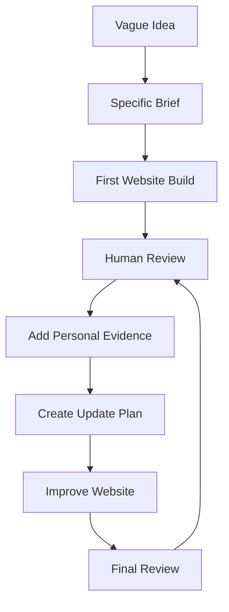

# Project 3 Workflow: Evidence-Driven Iterative AI Prompting

This document outlines the systematic engineering process used to build Kamran Khan's professional personal website. It highlights the transformation from an underspecified initial concept to a validated, evidence-backed digital portfolio.

---

## Workflow Flowchart

> **Iterative Improvement Loop:** The transition from `H [Final Review]` back to `D [Human Review]` ensures that every piece of content, credential, and interactive feature undergoes rigorous human verification rather than accepting generative hallucinations or generic default templates.

---

## Detailed Step-by-Step Breakdown

### 1. Vague Idea (Novice Request)
* **Initial Prompt:** `"I was in Summer Camp learning AI this June. Now I am thinking to create a personal website that shows everything about me and what I have learned in this Summer Camp. Share what goes into the personal website."`
* **Deficiency:** Lacks target audience, persona, technical stack, genuine artifacts, color palette, or verifiable qualifications.
* **Resulting Output:** Generic student sections, cliché "passionate about tech" phrases, generic skills, placeholder links.

### 2. Specific Brief
* **Formulation:** Defined precise scope, professional positioning, target audiences, and modern visual design principles.
* **Identity Anchoring:**
  * **Name:** Kamran Khan
  * **Role:** GIAIC Student | Agentic AI & Python Developer | Digital Marketer | Cloud & Applied Generative AI Learner
  * **Target Audience:** Friends, relatives, businesses, potential clients, tech professionals, AI learners.
  * **Design Standards:** Dark modern tech aesthetic, clean typography (Inter/system-ui), subtle glassmorphism, responsive across desktop, tablet, and mobile.

### 3. First Website Build
* **Execution:** Scaffolded core layout, modular React components, and responsive grid system.
* **Architecture:** Python orchestrator (`main.py`) paired with modular frontend components (`Navbar`, `Hero`, `About`, `Skills`, `Contact`).

### 4. Human Review (Gap Identification)
* **Critique:** Identified missing personal proof. The site looked structured but could belong to anyone.
* **Missing Elements:**
  * No demonstrable game development work.
  * No evidence of actual AI assistant usage workflows.
  * No verified link to the official AI Prompting 2026 syllabus.
  * No certificate preview or verification path.

### 5. Add Personal Evidence
* **Web Game Showcase:** Linked real web game reference (`https://snake-game-by-junaid.netlify.app/`) with transparent attribution and live game button.
* **AI Assistant Mastery:** Detailed practical workflows for ChatGPT, Claude, and Gemini (Prompt design, context engineering, iterative refinement).
* **Curriculum Grounding:** Integrated Panaversity Agent Factory official resource (`https://agentfactory.panaversity.org/docs/ai-prompting-2026`).
* **Examination Certification:** Integrated Summer Camp completion exam certificate modal, credential verification, and `PLACE-CERTIFICATE-HERE.txt` guide.

### 6. Create Update Plan
* **Action Items:**
  1. Build an interactive Prompt Evolution section with 4 visual stages.
  2. Implement interactive modal/lightbox for the Summer Camp Certificate.
  3. Wire Python FastAPI backend endpoints for health, portfolio data, and contact intake.
  4. Write automated Python verification tests (`test_main.py`, `test_content.py`).

### 7. Improve Website
* **Enhancements Implemented:**
  * Dynamic Prompt Evolution comparison timeline.
  * Web game live preview card with embedded game mechanics.
  * AI assistants matrix highlighting iterative prompt engineering workflows.
  * Strict adherence to zero-hallucination authenticity rules.

### 8. Final Review & Continuous Loop
* **Verification Checks:**
  * Zero invented metrics, fake clients, or unearned degrees.
  * Responsive testing across 375px, 480px, 768px, 1024px, and 1440px.
  * Interactive components (modals, smooth navigation, mobile drawer) fully functional.
  * Python orchestrator and test suite passing with 100% compliance.
